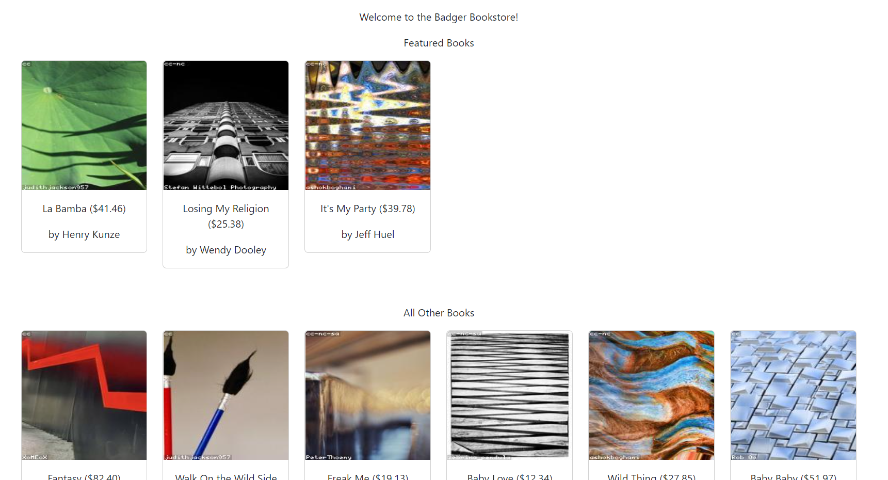
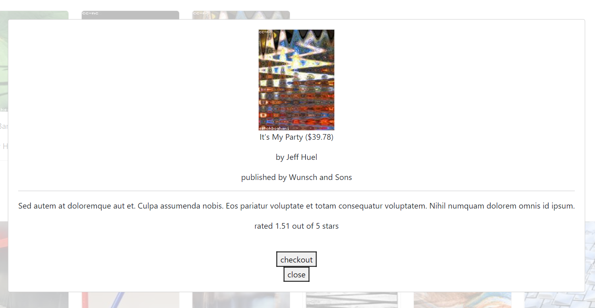

# CS571 Week 03: Badger Bookstore (React)

Welcome to the new Badger Bookstore! For this assignment, you will complete a bookstore similar to that of HW2, but this time using React! Following, you will apply aspects of visual design.  **Make sure to complete both parts of this assignment.** The visual design assignment requires you to change aspects of your code.



## Badger Bookstore

The starter code provided to you was generated using [create-react-app](https://www.npmjs.com/package/create-react-app). Furthermore, [bootstrap](https://www.npmjs.com/package/bootstrap) and [react-bootstrap](https://www.npmjs.com/package/react-bootstrap) have already been installed. **You should *not* re-run the create-react-app command**. Instead, in this directory, simply run...

```bash
npm install
npm start
```

Then, in a browser, open `localhost:3000`. You should *not* open index.html in a browser; React works differently than traditional web programming! When you save your changes, they appear in the browser automatically. I recommend using [Visual Studio Code](https://code.visualstudio.com/) to do your development work.

The components you will be working on are located in the `components` folder. Aspects of `BadgerBook.js` and `BadgerBookstore.js` have already been completed for you, but there is still much work to do.

The Badger Bookstore will have two sections for the user to browse: a selection of 3 featured books and a selection of 15 other books. All books will be randomly generated. Clicking on any book will display a modal with more information for the user.

All data can be retrieved via API calls to `https://www.coletnelson.us/cs571/f22/hw3/api/books?amount=#`. This API is very similar to HW2's API, except each book now returns with a corresponding unique `id` and `imageUrl`. Again, like the last assignment, you will only be using *some* of the data.


### 1. React Hooks -- `useState`

In `BadgerBookstore.js`, use the React `useState` hook to create a state called `featuredBooks` with state modifier `setFeaturedBooks`. Then use `useState` again to create a state called `otherBooks` with state modifier `setOtherBooks`. Both of these states should be initialized to an empty array.

**Hint**: Getting a "not defined" error when saving? Don't forget to import the `useState` hook!

### 2. React Hooks -- `useEffect`

In `BadgerBookstore.js`, using the `useEffect` hook, fetch book data and save it to `featuredBooks` and `otherBooks`. API calls should be made to `https://www.coletnelson.us/cs571/f22/hw3/api/books?amount=3` and `https://www.coletnelson.us/cs571/f22/hw3/api/books?amount=15` respectively. You can use a quick `console.log` to verify that you are receiving data.

**Hint:** Getting *weird* behavior? Use the F12 > Network console of your browser and make sure that you are not getting 429 status codes from the API. If you are, you most likely [did not define a dependency argument](https://www.w3schools.com/react/react_useeffect.asp) for `useEffect` and have an infinite loop! You'll need to stop your app, wait 2 minutes (so that you are no longer locked out of the API), and start your app again.


### 3. Map Book Data

In `BadgerBookstore.js`, display all of the featured and all of the other books. Currently, a `DUMMY_BOOK` is being displayed to give you an idea about how data is passed as props in React. You should remove this. Instead, for both `featuredBooks` and `otherBooks`, use the `map` function to display a `Col` of `BadgerBook` for each book, passing down the individual book's data as its props. Make sure to give each component a unique key.

### 4. Format Book Data

The display should be reactive; that is, the website should be usable for phone, tablet, and desktop devices. In `BadgerBookstore.js`, use the [React Bootstrap grid system](https://react-bootstrap.github.io/layout/grid/) so that...
 - 1 column of cards is shown for `xs` devices.
 - 2 columns of cards are shown for `sm` devices.
 - 3 columns of cards are shown for `md` devices.
 - 4 columns of cards are shown for `lg` devices.
 - 6 columns of cards are shown for `xl` or larger devices.

This applies to both the featured and other book sections.

### 5. Display Book Data
The Card component of `BadgerBook.js` has been completed for you; however, the Modal has not. In each book's modal, display the following information...
 - name
 - price (to 2 decimal places, display as USD)
 - author name
 - publisher
 - description
 - rating (out of 5 stars)

How you display this information is up to you, you will likely re-visit this as a part of visual design.



### 6. Add Book Functionality
Furthermore, you should add 2 buttons to the modal.
 - Add a "checkout" button that alerts the user the book has been checked out. This does not need to *do anything* other than `alert` the user.
 - Add a "close" button that simply closes the modal.

Again, how you choose to display these controls is up to you.

### 7. Unique Images
In the HW3 API, an additional `imageUrl` property has been added. Rather than using the LoremFlickr URL directly, use the book's unique `imageUrl`. This should be used both on the Card and Modal. Each book will now display a unique-ish image.

## Visual Design

The above screenshots show a barebones implementation of our bookstore, at least from a design perspective. Use aspects of visual design to improve the aesthetics and appeal of Badger Bookstore. These could include the usage of elements such as *space*, *line*, *shape*, *size*, *pattern*, *texture*, or *value*. These could also include the usage of principles such as *focal point*, *contrast*, *balance*, *movement*, *rhythm*, *perspective*, or *unity*.

Anything from the lecture slides or any aspect that would improve visual design is fair game. Taking visual design into consideration, make 3-4 changes\* to Badger Bookstore and implement them in your code. Then, below, make a bulleted list of your changes, why you made them, and how they impact the overall design. Each bullet point should be 1-2 sentences.

If you were not able to complete the coding segment of this assignment, please create a Figma prototype demonstrating your visual design choices and paste a *public* link below.

___

\*a change is broadly defined as an action that **positively and meaningfully** impacts visual design. Use your best judgement, and justify your changes using your response.

**INSERT YOUR BULLETED LIST OF CHANGES HERE.**